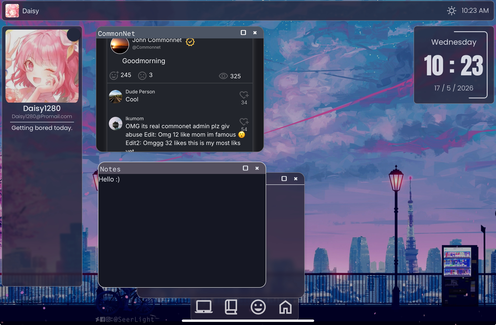

# 🌳 OSGarden

> An elegant, minimal operating system simulation featuring a virtual social media platform (CommonNet).



---

## 🛠️ Tech Stack

This project leverages modern frontend technologies and developer tools:

[](https://react.dev/)
[](https://vite.dev/)
[](https://tailwindcss.com/)
[](https://reactrouter.com/)
[](https://www.python.org/)

---

## 📂 Project Structure

```text
OSGarden/
├── main/                  # Frontend Vite + React application (Lilum OS)
│   ├── src/               # React components, routing, and data context
│   └── public/            # Static public assets
├── Data/                  # Shared system files, assets, and images
├── Calc/                  # Computational engine (CommonNet backend logic)
└── Tools/                 # Developer CLI utilities (e.g. creating simulated data)
```

---

## 🚀 Getting Started

### 1. Installation

Clone the repository and install the dependencies for the web interface:

```bash
# Clone the repository
git clone https://github.com/stellarblue05/OSGarden.git

# Navigate to the project root
cd OSGarden

# Go to the frontend application directory
cd main

# Install dependencies
npm install
```

### 2. Development

Start the local development server:

```bash
npm run dev
```

Open `http://localhost:5173` in your browser to view the operating system simulation.

### 3. Generate Simulated Users & Posts

You can populate the CommonNet virtual social media app with custom user profiles and posts using the interactive Python CLI:

```bash
# Go to the Tools folder
cd Tools/CommonNet

# Run the creation utility
python create.py
```

---

## 🌐 Hosting & Continuous Deployment (CI/CD)

Whenever you or your team pushes a new commit to GitHub, your hosted website can automatically update. Here are the two best ways to set this up.

### Method 1: GitHub Pages (Via GitHub Actions — Recommended & Fully Configured)

We have already configured a GitHub Actions workflow inside this project (`.github/workflows/deploy.yml`) to automatically build and host the React/Vite app on GitHub Pages.

#### Step 1: Push your code to GitHub (Using Git Bash)
Open **Git Bash** in the root of your project directory and run:

```bash
# Initialize local git repository
git init

# Stage all files
git add .

# Commit changes
git commit -m "chore: initial commit with auto-deploy configuration"

# Create a repository on GitHub (https://github.com/new)
# Link your local repo to GitHub (replace with your URL)
git remote add origin https://github.com/your-username/OSGarden.git

# Set default branch to main
git branch -M main

# Push to your GitHub repository
git push -u origin main
```

#### Step 2: Enable GitHub Pages in your repository settings
1. Go to your repository page on **GitHub.com**.
2. Click on **Settings** (the gear icon at the top).
3. Scroll down the left sidebar and click on **Pages**.
4. In the **Build and deployment** section, look for **Source**.
5. Change the dropdown from **Deploy from a branch** to **GitHub Actions**.

✨ **Done!** From now on, whenever you or your team run `git push origin main` in Git Bash, GitHub will automatically rebuild the app and publish it online!

---

### Method 2: Vercel (Super Easy Zero-Config Alternative)

If you prefer using Vercel, it connects directly to GitHub and requires no workflows:

1. Create a free account on [Vercel.com](https://vercel.com).
2. Click **Add New** > **Project** and import your GitHub repository.
3. In the configuration settings, search for **Root Directory** and select **`main`**.
4. Click **Deploy**.

Vercel will detect Vite, build it, and automatically redeploy the site every time a change is pushed to your `main` branch.


67